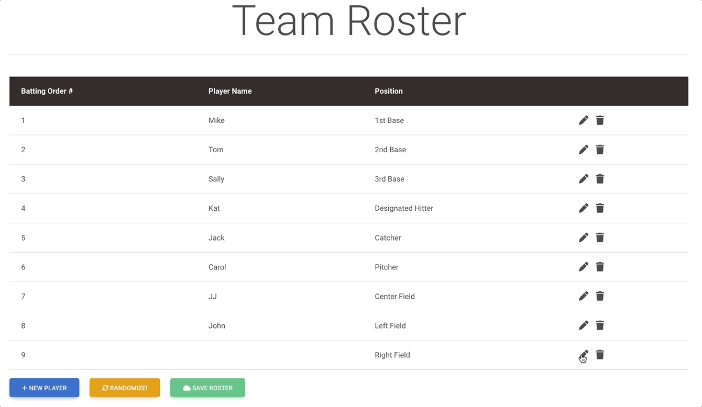

# Random Batting Order React UI
This is a fun little react UI application for creating a baseball/softball batting roster.
It's killer feature is that it has a randomize button that will shuffle the players to create a random batting order.

# What it looks like:



# Technologies Used
 * ReactJS `18.x`
 * React Select `5.x` (for drop down react component)
 * mdb-react-ui-kit `5.x.x` (for ui design template)

# How to Run locally
First you need to clone or download the zip of this github repo
```
git clone https://github.com/goshipcode/random-batting-order.git
```

Navigate into this repo's directory on your computer:
```
cd random-batting-order
```

Install the app with `npm` (If you don't have npm, then [install nodejs here](https://nodejs.org/en/download/))
```
npm install
```

Now you can choose to run with npm or docker locally. Instructions below:

#### Run locally with NPM (best for development)
Run the app on your computer:
```
npm start
```
Now visit:

* http://localhost:3000/

* OR: http://localhost:3000/random-batting-order
    * ^ This is the default since we set the homepage field in package.json. That `homepage` field is needed for gh-pages
    to work, so feel free to remove it if you want it. If you remove it, then default will be `http://localhost:3000/`


#### Run locally with Docker
First you need to have docker available on your machine. ([Install here](https://docs.docker.com/engine/install/) if need it)

** FYI the [Dockerfile](./Dockerfile) is at the root of this project

From the root of this project execute the docker build
```
docker build -t random-batting-order:0.0.1 .
```

Now run the docker image you just created
```
docker run -p3000:3000 random-batting-order:0.0.1
```

Now visit:

* http://localhost:3000/

# How Deploy to Github Pages

To deploy this application using [Github Pages](https://pages.github.com/). I'm using the [gh-pages npm](https://www.npmjs.com/package/gh-pages) package.
This package enables you to deploy your static react UI to gh-pages branch on your repo to be hosted publicly by Github. 

**Steps to deploy:**
1. Fork this repo, or push to your own Github repo. 
2. In your [package.json](./package.json) Set the `homepage` field to your specific repo's name: `"homepage": "https://<YOUR_GITHUB_USERNAME>.github.io/<YORU_REPO_NAME>",`
   For example this repo is set to this: `"homepage": "https://goshipcode.github.io/random-batting-order",`
3. Add in `predeploy` and `deploy` scripts in your `package.json` file
```
  "predeploy": "npm run build",
  "deploy": "gh-pages -d build",
```
4. Run `npm run deploy` which will deploy your project to your repo's gh-pages branch
5. Now go to github and click on Settings -> Pages -> Branch -  
6. Under `Build and deployment` select `gh-pages` as the branch to build from. Now click `Save`
7. A Github action will build in the background and deploy your gh-pages site. 
8. Visit your site at `https://<YOUR_GITHUB_USERNAME>.github.io/<YORU_REPO_NAME>`
   
You can see this repo's gh-pages site live here: https://goshipcode.github.io/random-batting-order/

# Know bugs
* The select dropdown doesn't populate with the preloaded position at the beginning. It just says: `Select...`
* After you click the `randomize` button, the select position gets out of sync when you try to edit a row. 

Since this is just a demo application for others to use, I didn't fully perfect it, but the main functionality does work.
If you figure it out, let me know, and I can update it!
                                               
